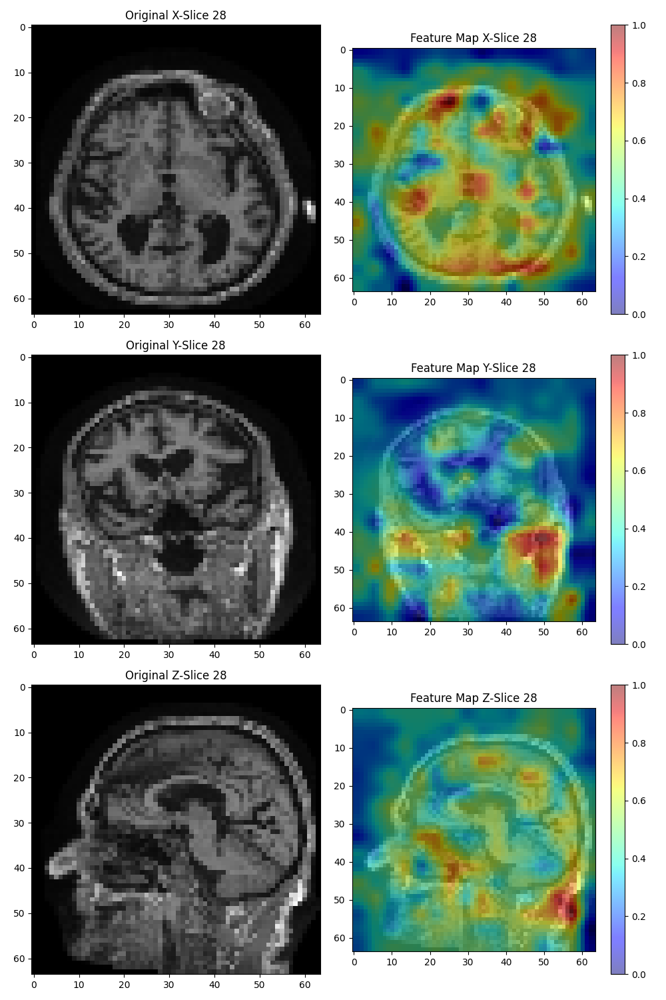

# Gradcam-3D
## Table of Contents
- [Introduction](Introduction)
- [Preparation](Preparation)
- [Example](Example)
  
## Introduction
This is a code for generating 3D gradcam, I hope it will be useful for you
## Preparation
If you want to use this code, first you need to change a few pieces of code in `cam.py`
#### using your own dataset
```bash
from dataset import Dataset
```
#### import your model
```bash
from models.resnet_50 import resnet50_3d
```
#### Change to the `target_layer` of the model you want to generateChange to the target_layer of the model you want to generate
```bash
target_layers = [model.layer1]
```
## Example
The result is as follows：

